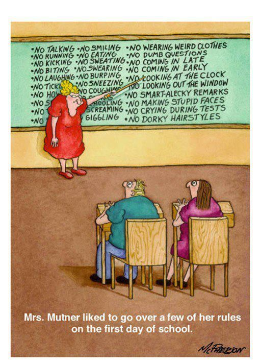

# Course Policies

Some common policies that I use for most of my courses. The specific policies of a given semester are shared in the associated Learning Management System (LMS, e.g. bCourses, Canvas).

- [Lab Policy](https://github.com/gastonstat/course-policies/blob/main/policy-lab.md)

- [HW Policy](https://github.com/gastonstat/course-policies/blob/main/policy-hw.md)

- [Email Policy](https://github.com/gastonstat/course-policies/blob/main/policy-email.md)

- [Academic Integrity](https://github.com/gastonstat/course-policies/blob/main/policy-academic-integrity.md)

